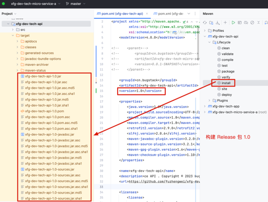

### 发布模块到中央仓库 center mvnrepository

#### pom.xml参考
```xml
<?xml version="1.0" encoding="UTF-8"?>
<project xmlns="http://maven.apache.org/POM/4.0.0"
         xmlns:xsi="http://www.w3.org/2001/XMLSchema-instance"
         xsi:schemaLocation="http://maven.apache.org/POM/4.0.0 http://maven.apache.org/xsd/maven-4.0.0.xsd">
<modelVersion>4.0.0</modelVersion>

<groupId>com.oo.tools.comomon</groupId>
<artifactId>publish-package</artifactId>
<version>0.0.0-SNAPSHOT</version>

<properties>
  <java.version>17</java.version>
  <project.build.sourceEncoding>UTF-8</project.build.sourceEncoding>
<!--  <maven.compiler.source>1.8</maven.compiler.source>
  <maven.compiler.target>1.8</maven.compiler.target>-->
  <retrofit2.version>2.9.0</retrofit2.version>
  <slf4j.version>2.0.6</slf4j.version>
  <maven-javadoc-plugin.version>3.2.0</maven-javadoc-plugin.version>
  <maven-source-plugin.version>3.2.1</maven-source-plugin.version>
  <maven-gpg-plugin.version>1.6</maven-gpg-plugin.version>
  <maven-checksum-plugin.version>1.10</maven-checksum-plugin.version>
</properties>

<name>publish-package</name>
<description>ce API . Copyright © 2024 Ackman.cn All Rights Reserved. 版权所有（C）</description>
<url>https://github.com/fuzhengwei/xfg-dev-tech-micro-service-a</url>

<licenses>
  <license>
    <name>Apache License</name>
    <url>https://opensource.org/license/apache-2-0/</url>
    <distribution>repo</distribution>
  </license>
</licenses>

<developers>
  <developer>
    <id>Xiaofuge</id>
    <name>Xiaofuge</name>
    <email>184172133@qq.com</email>
    <url>https://github.com/fuzhengwei</url>
    <organization>xfg-dev-tech-micro-service-a</organization>
    <organizationUrl>https://github.com/fuzhengwei/xfg-dev-tech-micro-service-a</organizationUrl>
    <roles>
      <role>architect</role>
      <role>developer</role>
    </roles>
    <timezone>Asia/Shanghai</timezone>
  </developer>
</developers>

<scm>
  <connection>scm:git:https://github.com/fuzhengwei/xfg-dev-tech-micro-service-a.git</connection>
  <developerConnection>scm:git:https://github.com/fuzhengwei/xfg-dev-tech-micro-service-a.git</developerConnection>
  <tag>HEAD</tag>
  <url>https://github.com/fuzhengwei/xfg-dev-tech-micro-service-a</url>
</scm>

<build>
  <plugins>
    <plugin>
      <groupId>org.apache.maven.plugins</groupId>
      <artifactId>maven-compiler-plugin</artifactId>
      <version>3.0</version>
      <configuration>
        <source>${java.version}</source>
        <target>${java.version}</target>
        <encoding>${project.build.sourceEncoding}</encoding>
      </configuration>
    </plugin>
    <plugin>
      <groupId>org.apache.maven.plugins</groupId>
      <artifactId>maven-gpg-plugin</artifactId>
      <version>1.5</version>
      <executions>
        <execution>
          <id>sign-artifacts</id>
          <phase>verify</phase>
          <goals>
            <goal>sign</goal>
          </goals>
        </execution>
      </executions>
    </plugin>
    <plugin>
      <groupId>org.apache.maven.plugins</groupId>
      <artifactId>maven-surefire-plugin</artifactId>
      <version>2.12.4</version>
      <configuration>
        <skipTests>true</skipTests>
      </configuration>
    </plugin>
    <plugin>
      <groupId>org.apache.maven.plugins</groupId>
      <artifactId>maven-source-plugin</artifactId>
      <version>2.2.1</version>
      <executions>
        <execution>
          <id>attach-sources</id>
          <goals>
            <goal>jar-no-fork</goal>
          </goals>
        </execution>
      </executions>
    </plugin>
    <plugin>
      <groupId>org.apache.maven.plugins</groupId>
      <artifactId>maven-javadoc-plugin</artifactId>
      <version>2.9.1</version>
      <configuration>
        <encoding>UTF-8</encoding>
        <aggregate>true</aggregate>
        <charset>UTF-8</charset>
        <docencoding>UTF-8</docencoding>
      </configuration>
      <executions>
        <execution>
          <id>attach-javadocs</id>
          <goals>
            <goal>jar</goal>
          </goals>
          <configuration>
            <additionalparam>-Xdoclint:none</additionalparam>
            <javadocExecutable>
              /Library/Java/JavaVirtualMachines/jdk1.8.0_311.jdk/Contents/Home/bin/javadoc
            </javadocExecutable>
          </configuration>
        </execution>
      </executions>
    </plugin>
    <plugin>
      <groupId>org.apache.maven.plugins</groupId>
      <artifactId>maven-release-plugin</artifactId>
      <version>2.5.3</version>
      <configuration>
        <autoVersionSubmodules>true</autoVersionSubmodules>
        <useReleaseProfile>false</useReleaseProfile>
        <releaseProfiles>release</releaseProfiles>
        <goals>deploy</goals>
      </configuration>
    </plugin>
    <plugin>
      <groupId>net.nicoulaj.maven.plugins</groupId>
      <artifactId>checksum-maven-plugin</artifactId>
      <version>${maven-checksum-plugin.version}</version>
      <executions>
        <execution>
          <id>create-checksums</id>
          <goals>
            <goal>artifacts</goal>
          </goals>
        </execution>
      </executions>
    </plugin>
  </plugins>
</build>

<profiles>
  <profile>
    <id>release</id>
    <build>
      <plugins>
        <plugin>
          <groupId>org.apache.maven.plugins</groupId>
          <artifactId>maven-javadoc-plugin</artifactId>
          <version>2.9.1</version>
          <executions>
            <execution>
              <id>attach-javadocs</id>
              <goals>
                <goal>jar</goal>
              </goals>
              <configuration>
                <additionalparam>-Xdoclint:none</additionalparam>
                <javadocExecutable>
                  /Library/Java/JavaVirtualMachines/jdk1.8.0_311.jdk/Contents/Home/bin/javadoc
                </javadocExecutable>
              </configuration>
            </execution>
          </executions>
        </plugin>
      </plugins>
    </build>
  </profile>
</profiles>

</project>
```

```text
注意，<groupId>cn.bugstack</groupId> 这里不能是继承。
maven-javadoc-plugin：生成 doc 文档。这里要注意，因为我们脚手架不是代码文件，没有doc的，所以要在工程中加一个任意类名文件。工程中小傅哥加了个 Api 类。
maven-source-plugin：生成 source 文件。
maven-gpg-plugin：是签名的加密文件，需要本地安装过 gpg 包。注意；checksum-maven-plugin 需要在 maven-gpg-plugin 执行，这样就不用做下面的手动 md5 逻辑了。
checksum-maven-plugin：生成 md5、sha1 文件，但这里不会对 pom 生成此文件，还需要单独命令处理。
/Library/Java/JavaVirtualMachines/jdk1.8.0_311.jdk/Contents/Home/bin/javadoc 配置你自己的 jdk 地址。
```
```shell
md5 ddd-scaffold-lite-1.0.pom > ddd-scaffold-lite-1.0.pom.md5
shasum ddd-scaffold-lite-1.0.pom > ddd-scaffold-lite-1.0.pom.sha1
```
检查生成后的文件，去掉不需要的内容

### 构建项目
使用`mvn install -DskipTests` 构建项目，会生成一个jar包，在target目录下。


### 执行命令

```shell
md5 xfg-dev-tech-api-1.0.pom > xfg-dev-tech-api-1.0.pom.md5
shasum xfg-dev-tech-api-1.0.pom > xfg-dev-tech-api-1.0.pom.sha1
```
构建后，执行命令。增加新的校验文件。

### 打包文件

- 创建一个和构建一样路径的文件夹，mac/linux 操作命名；mkdir -p cn/bugstack/xfg-dev-tech-api/1.0/
- 之后把文件复制到文件夹中打一个zip包。

### 提交

提交你的压缩包

### 等待通过&发包

- 稍微等待，验证通过后可以点击 Publish 发布。
- 预计4-12小时后会同步到 maven 中心仓库以及阿里云的仓库。


地址: https://mvnrepository.com/search?q=cn.bugstack